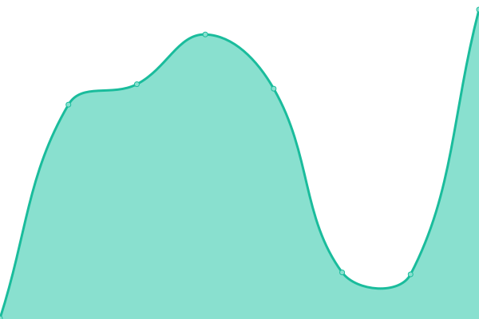
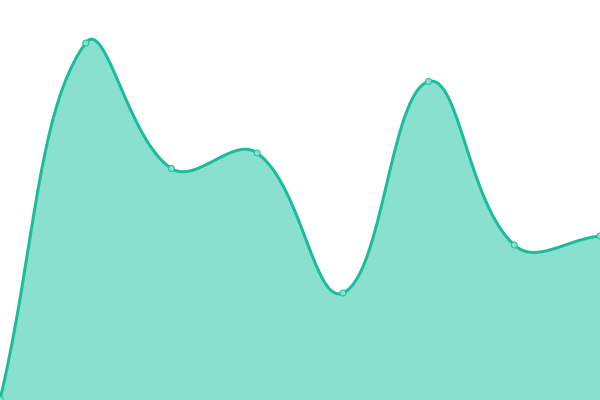

# [📈 Live Status](https://demo.upptime.js.org): <!--live status--> **🟧 部分停机**

This repository contains the open-source uptime monitor and status page for [Upptime](https://upptime.js.org), powered by [Upptime](https://github.com/upptime/upptime).

With [Upptime](https://upptime.js.org), you can get your own unlimited and free uptime monitor and status page, powered entirely by a GitHub repository. We use [Issues](https://github.com/upptime/upptime/issues) as incident reports, [Actions](https://github.com/edmondsket/upptime/actions) as uptime monitors, and [Pages](https://demo.upptime.js.org) for the status page.

<!--start: status pages-->
<!-- This summary is generated by Upptime (https://github.com/upptime/upptime) -->
<!-- Do not edit this manually, your changes will be overwritten -->
<!-- prettier-ignore -->
| 链接 | 状态 | 历史 | 响应时间 | 正常运行时间 |
| --- | ------ | ------- | ------------- | ------ |
|  [Google](https://www.goo000gle.cm) | 🟥 停机 | [google.yml](https://github.com/edmondsket/upptime/commits/HEAD/history/google.yml) | 

 0毫秒
     
 | 

<a href="https://edmondsket.github.io/upptime/history/google">100.00%</a>
    

|  [Main Site 平替生活](https://cheapy.top) | 🟩 正常运行 | [main-site.yml](https://github.com/edmondsket/upptime/commits/HEAD/history/main-site.yml) | 

 1000毫秒
     
 | 

<a href="https://edmondsket.github.io/upptime/history/main-site">97.45%</a>
    

|  [Nav Site 平替导航](https://nav.cheapy.top) | 🟩 正常运行 | [nav-site.yml](https://github.com/edmondsket/upptime/commits/HEAD/history/nav-site.yml) | 

 508毫秒
     
 | 

<a href="https://edmondsket.github.io/upptime/history/nav-site">100.00%</a>
    

|  [Download Site 平替下载站](https://dl.ptlife.eu.org) | 🟩 正常运行 | [download-site.yml](https://github.com/edmondsket/upptime/commits/HEAD/history/download-site.yml) | 

 476毫秒
     
 | 

<a href="https://edmondsket.github.io/upptime/history/download-site">100.00%</a>
    

<!--end: status pages-->

[**Visit our status website →**](https://demo.upptime.js.org)

## 📄 License

- Powered by: [Upptime](https://github.com/upptime/upptime)
- Code: [MIT](./LICENSE) © [Upptime](https://upptime.js.org)
- Data in the `./history` directory: [Open Database License](https://opendatacommons.org/licenses/odbl/1-0/)
